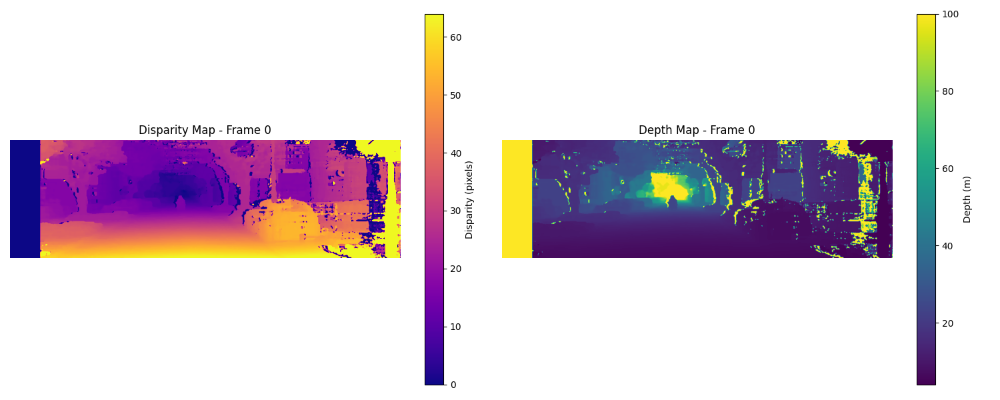
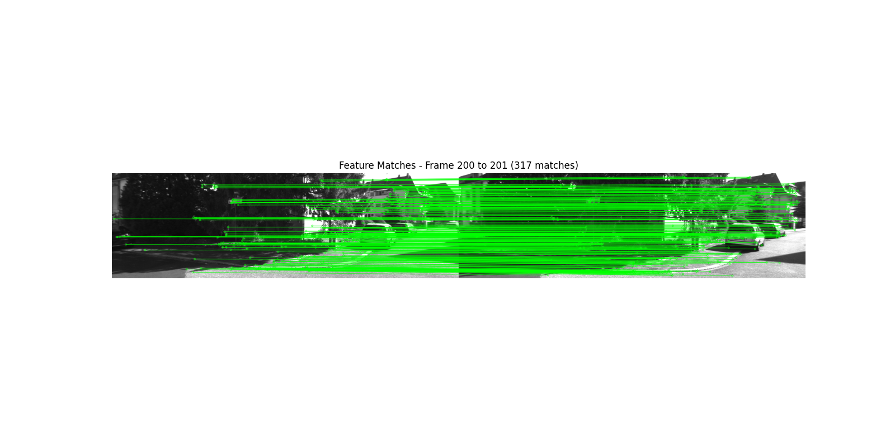
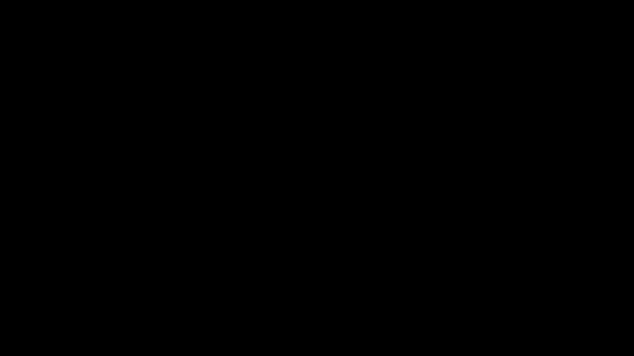
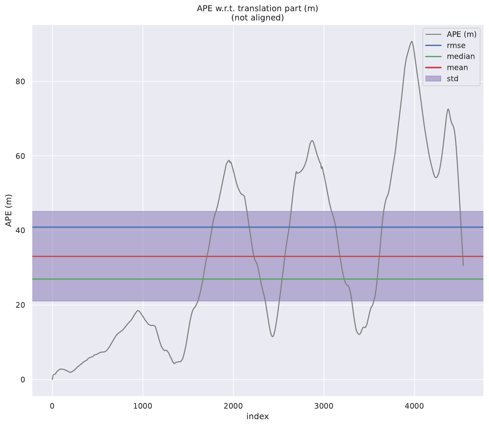
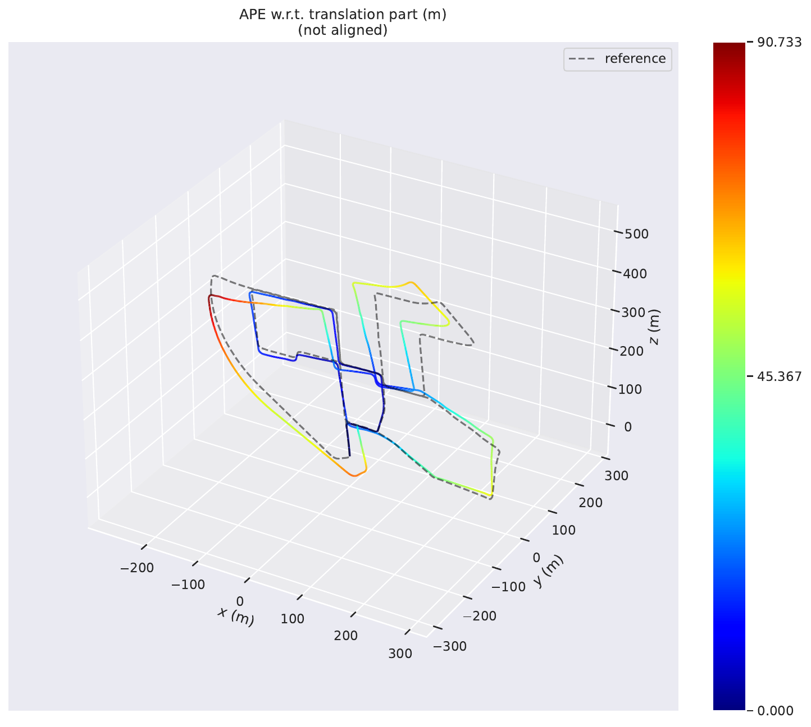
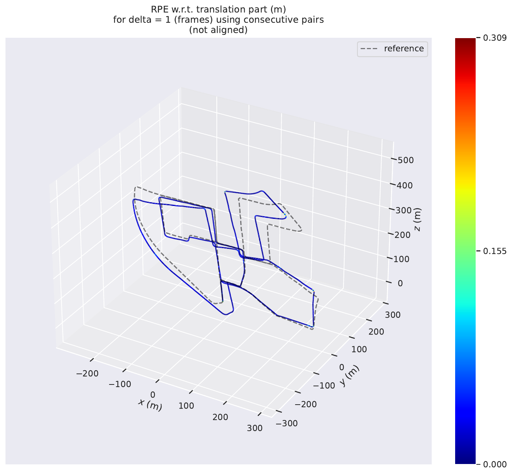
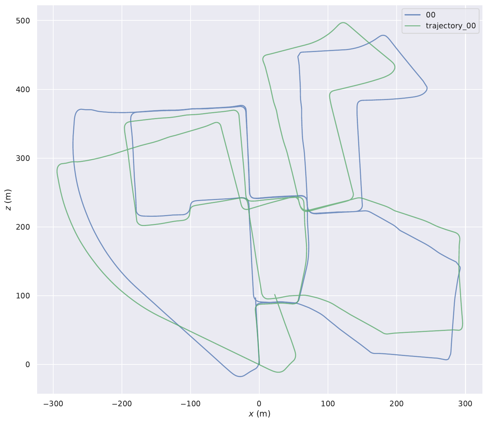
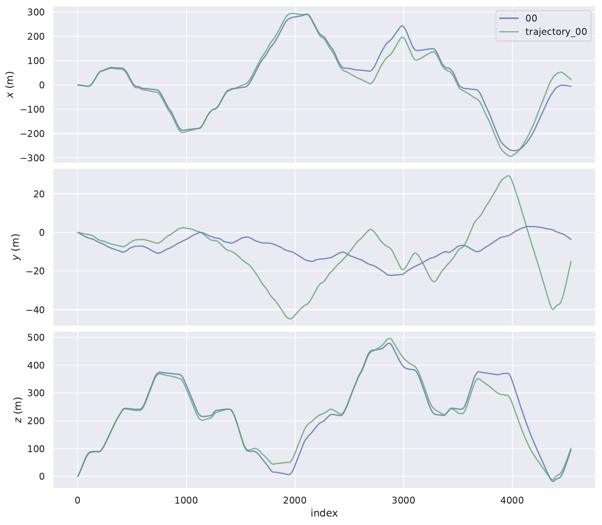
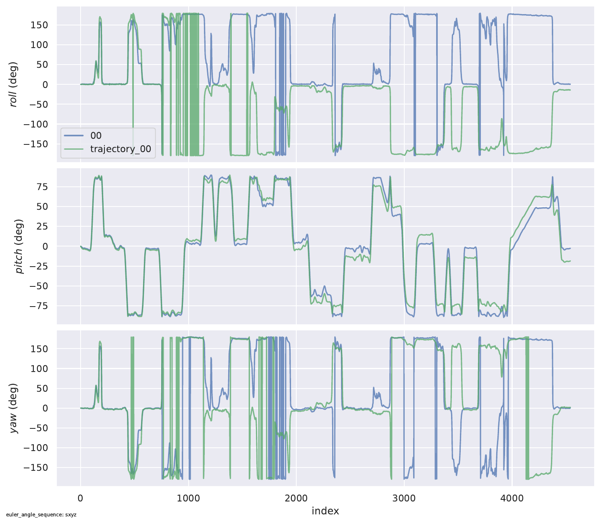

# Stereo Visual Odometry (KITTI)

Python implementation of stereo visual odometry for KITTI odometry sequences.

## Project Structure

```
stereo_visual_odometry/
├── main.py                      # runs the whole pipeline
├── config.yaml                  # settings for features, frames, visualization
├── src2/                        # core modules
│   ├── calibration.py          # loads camera params from KITTI
│   ├── features.py             # detects and matches SIFT features
│   ├── stereo_depth.py         # computes depth from stereo images
│   ├── motion_estimation.py    # estimates camera motion with PnP RANSAC
│   └── visualization.py        # plots 2D trajectory
├── dataset/                     # KITTI data
│   ├── sequences/00/
│   └── poses/00.txt
└── results/                     # output trajectories and plots
```
## Installation

```bash
git clone https://github.com/190ibrahim/stereo-visual-odometry-kitti.git
cd stereo-visual-odometry-kitti
git checkout python-stereo-vo

pip install opencv-python numpy matplotlib pyyaml evo
```

## Dataset Setup

Download from KITTI: http://www.cvlibs.net/datasets/kitti/eval_odometry.php
- odometry dataset (grayscale images)
- odometry ground truth poses

organize like this:
```
dataset/
├── sequences/00/
│   ├── image_0/     # left camera
│   ├── image_1/     # right camera
│   ├── calib.txt
│   └── times.txt
└── poses/00.txt     # ground truth
```

## Usage

```bash
python main.py
```

## How It Works

here's what happens for each frame pair. we start with two stereo images - left and right cameras capturing the same scene. the stereo matcher (SGBM - semi-global block matching) compares them and finds corresponding pixels between left and right images. for each pixel in the left image, we search for the same point in the right image. the horizontal shift is called disparity and produces a disparity map (see image below). brighter pixels mean closer objects, darker means farther away. 

disparity (d) relates to depth (Z) through stereo geometry:
```
Z = (fx × baseline) / disparity
```

then we convert this disparity to actual depth in meters using the camera's focal length and baseline distance. this gives us a depth map - every pixel now has a distance value. you can see both the disparity and depth maps side by side in the visualization.

<p align="center">
  
</p>
<p align="center"><em>left: disparity map (brighter = closer) | right: depth map (color = distance in meters)</em></p>

next we detect features. SIFT finds interesting points like corners and edges in the current frame and the next frame. we match these features between the two frames using Lowe's ratio test:
```
if distance(best_match) < 0.35 × distance(second_best_match):
    accept match
else:
    reject (probably wrong)
```

this ratio test filters out bad matches. the green lines in the image below connect the same feature in both frames - these are the points we successfully tracked.

<p align="center">
  
</p>
<p align="center"><em>green lines show matched features between consecutive frames</em></p>

now we combine the depth map with the feature matches. for each matched feature, we know where it is in 2D (pixel coordinates) and how far away it is (from the depth map). this lets us build 3D points in camera space. we filter out points with depth > 3000 (probably errors from stereo matching) or depth ≤ 0 (invalid).

we take these 3D points from the current frame and their 2D locations in the next frame, then use PnP RANSAC to figure out how the camera moved. PnP (perspective-n-point) solves for camera rotation R and translation t that project the 3D points onto the 2D image:
```
p2D = K × [R|t] × p3D
```

RANSAC runs this many times with random subsets and picks the solution with most inliers (points that fit well). this removes outliers - wrong matches that would mess up the estimate. we use 1000 RANSAC iterations (more = better but slower) and 8.0 pixel reprojection error threshold (how much error we tolerate).

each frame gives us a transformation matrix T:
```
T = [R  t]
    [0  1]
```

we multiply these together to get absolute position:
```
pose[i+1] = pose[i] × T^(-1)
```

we do this for every frame. the trajectory is the camera position at each frame - we extract the translation part (T[0:3, 3]) to plot the path. the plot shows our estimated path in blue against the ground truth in gray.

<p align="center">
  
</p>
<p align="center"><em>real-time visualization: blue line (estimated) builds frame by frame, compared to gray (ground truth)</em></p>

## Evaluation

we use evo toolbox to evaluate accuracy against ground truth. three metrics matter:

**ATE (absolute trajectory error)**: measures global consistency - how far off the entire path is from ground truth. good for seeing accumulated drift over long sequences.

**RPE (relative pose error)**: measures local accuracy - how much error per frame. better for understanding odometry drift rate.

run these commands:
```bash
# absolute trajectory error
evo_ape kitti dataset/poses/00.txt results/trajectory_00.txt --plot --save_plot results/ape_plot.pdf

# relative pose error  
evo_rpe kitti dataset/poses/00.txt results/trajectory_00.txt --plot --save_plot results/rpe_plot.pdf

# trajectory comparison
evo_traj kitti dataset/poses/00.txt results/trajectory_00.txt --plot_mode=xz -p --save_plot results/trajectory_comparison.pdf
```

## Results & Analysis

### KITTI Sequence 00 (4541 frames, 3.7 km path)

#### Absolute Trajectory Error (ATE)

ATE measures how far the estimated trajectory drifts from ground truth over the entire sequence.

```
max:     90.73 m
mean:    33.07 m
median:  26.97 m
rmse:    40.89 m
std:     24.05 m
```
<p align="center">
  
</p>
<p align="center"><em>error timeline: gray line shows actual error at each frame, colored bands show statistics</em></p>


the gray line is the actual error at each frame. horizontal bands show the statistics - red is mean, green is median, blue is rmse, purple is standard deviation.

**what happens over time:**

frames 0-1000: error stays under 20m. algorithm works well during the straight section at the start.

frame ~1200: first jump to 18m. this is the first big turn. rotation gets harder to estimate when the scene changes fast.

frames 1500-2500: error spikes to 60m. this section has multiple turns close together. each turn adds error on top of previous errors.

frames 2500-3500: drops back to ~10m during straight driving. shows the algorithm does fine when motion is simple.

frames 3500-4541: steady climb to 90m peak. all the accumulated errors from before plus new errors in the final turns. this is normal for odometry - errors never get fixed, only grow bigger.

the purple band shows where most errors should be (one standard deviation). when the gray line breaks out of this band, that's a problem area.
<p align="center">
  
</p>
<p align="center"><em>3D view: path colored by error amount - blue (good) to red (bad)</em></p>

this shows the same trajectory but colored by how wrong we are at each point. blue means low error (0-10m), red means high error (60-90m).

**spatial view insights:**

start (bottom left): blue and cyan colors mean under 10m error. we're tracking well.

middle sections: green and yellow mean 20-40m error. drift is building up.

sharp corners: yellow and orange mean 40-60m error. turns mess up the tracking.

end sections: orange and red mean 60-90m error. worst errors happen here.

**why corners are bad:**

straight sections stay blue/green because feature tracking works well. depth is reliable, matching is easier. but corners turn yellow/red because:
- fewer features stay visible between frames
- stereo matching breaks down when viewpoint changes
- small yaw errors become big position errors after driving forward

notice how the colored line (our estimate) starts close to the gray dashed line (truth) but slowly drifts away. the gap grows most at corners then stays roughly constant during straight parts.

the red parts at the end show we're 60-90m off from where we should be. if you look at the timeline plot around frame 4000+, that's when this happens.

**what this tells us:**

The algorithm doesn't know when it's wrong. Errors just pile up silently. No way to self-correct. Turns are the killer - every direction change adds error. Over 4500 frames with lots of turns, these compound to 90m total drift.

why it happens:
- RANSAC can't help if most feature matches are already bad
- PnP is only as good as the 3D points you feed it
- stereo depth gets noisy at turns (geometry changes)
- no loop closure to realize "we've been here before"

is 90m drift over 3700m bad? that's 2.4% error. for basic visual odometry without any corrections, that's reasonable. real systems use loop closure, bundle adjustment, or IMU fusion to do better.

#### Relative Pose Error (RPE)

RPE measures frame-to-frame drift, showing local accuracy independent of accumulated error.

```
max:     0.309 m
mean:    0.018 m
median:  0.014 m
rmse:    0.027 m
std:     0.020 m
```

<p align="center">
  
</p>
<p align="center"><em>frame-by-frame error: gray spikes show drift between consecutive frames</em></p>

this plot shows how much we drift between each pair of frames. the gray spiky line is the actual error. colored bands show statistics - blue is rmse, green is median, red is mean, purple is standard deviation.

**what happens frame by frame:**

most of the time: gray spikes stay under 0.05m. the algorithm tracks really well during normal driving.

frame 0: ~0.2m spike at the very start. initialization issue - first frame has nothing to compare to.

frames 1500-2500: three huge spikes hitting 0.31m, 0.25m, and 0.24m. this is the sharp turn section with multiple corners close together.

frame 3000: another spike to ~0.24m. another tricky turn.

rest of trajectory: occasional small spikes to 0.1m but mostly under 0.05m.

the purple band (standard deviation) is super tight around 0.02m. this means frame-to-frame tracking is consistent and predictable. spikes that shoot above this band are rare events.

**why RPE is different from ATE:** these spikes don't accumulate. each frame starts fresh. if frame 100 has 0.3m error but frame 101 has 0.01m error, that's fine - the algorithm recovered. this is why median is only 0.014m even though max is 0.309m.

<p align="center">
  
</p>
<p align="center"><em>3D view: path colored by frame-to-frame error - almost entirely blue (good)</em></p>

this shows the trajectory colored by how much each frame drifts from the previous one. blue means near-zero error, red would mean big drift.

**spatial view insights:**

almost entirely blue: most of the path is solid blue. frame-to-frame tracking error is near zero for most frames.

where's the red? hard to see much color variation because most errors are so small. the 0.3m spikes we saw in the timeline are brief moments - they don't last long enough to color whole sections.

what this means: tracking failures are isolated events, not sustained problems. the algorithm briefly loses accuracy during a challenging moment (sharp turn), then recovers immediately for the next frame.

**what these tell us together:**

local accuracy is strong: 1.8cm average drift per frame is solid. the algorithm does what it's supposed to - track motion between consecutive frames.

failure mode is brief: when things go wrong (those 0.3m spikes), it's temporary. next frame usually recovers to normal performance.

where failures happen:
- frame 0: initialization
- frames 1500-2500: sharp turns with multiple corners
- frame 3000: another tricky turn

why failures don't spread: unlike ATE where errors compound, RPE measures each frame independently. bad frame doesn't poison next frame. RANSAC and PnP start fresh each time.

**comparison with ATE:** ATE showed 90m accumulated error. but RPE shows we're only drifting 1.8cm per frame on average. the big ATE error comes from those 1.8cm errors adding up over 4541 frames, plus the occasional big spikes. death by a thousand cuts, not one massive failure.

bottom line: the algorithm's core feature tracking works well. frame-to-frame motion estimation is reliable. the accumulated drift in ATE isn't because tracking fails constantly - it's because small consistent errors compound over time without any correction mechanism.

#### Trajectory Comparison

<p align="center">
  
</p>
<p align="center"><em>top-down view: estimated path (green) vs ground truth (blue)</em></p>

**the big picture:** this shows where the car went from a bird's eye view. green is the true path (GPS ground truth), blue is our estimated path.

**what matches well:**

the overall loop shape is correct. we start at bottom left, drive diagonally up to top middle, make that big rectangular circuit, then return back down to bottom right. the algorithm got the general route right.

first half (frames 0-2000): blue and green are nearly on top of each other. excellent tracking. straight sections and gentle curves are handled perfectly.

middle section (frames 2000-3000): still pretty good alignment. some small offsets but the paths run parallel.

**where things diverge:**

top rectangular circuit (frames 1500-2500): this is where we saw the big RPE spikes. the blue path cuts corners slightly - instead of making sharp 90-degree turns like the green path, our estimate makes smoother rounded turns. we're undershooting the corners.

look at x=100, z=500 area: the green path makes a sharp right angle. blue path curves through it more gently. this is feature matching struggling during fast rotation.

return path (frames 3500-4500): blue path drifts slightly to the left of green. accumulated error from earlier mistakes. once we're off track, we never realign because there's no loop closure.

**critical insight:** the drift isn't random wandering. blue stays parallel to green, just offset. this means heading (yaw angle) is pretty good, but we've accumulated position offset that never gets corrected.

total endpoint error: blue ends about 40m away from green. for a 3.7km journey with no GPS correction, that's actually not terrible - about 1% drift.

<p align="center">
  
</p>
<p align="center"><em>x, y, z coordinates: frame-by-frame position comparison</em></p>

**x coordinate (sideways motion):**

frames 0-1200: perfect match. blue and green lines are identical. algorithm is nailing it.

frames 1200-1500: first divergence. green makes sharp jumps (quick turn), blue follows more smoothly. we're lagging behind the turn.

frames 1500-2500: the chaos zone. green makes rapid oscillations (rectangular turns), blue tries to follow but can't keep up. lots of back-and-forth motion happening fast.

frames 2500-end: offset established. blue and green run parallel but separated by 20-30m. we never close this gap.


**z coordinate (forward motion):**

this is the importnant plot. z is forward distance traveled.

frames 0-1500: beautiful synchronization. smooth curves matching perfectly. forward velocity estimation is accurate.

frames 1500-2500: still good! even during the crazy turns, z coordinate stays aligned. we know how fast we're moving forward, even if we're confused about direction.

frames 2500-end: slight divergence. blue reaches 500m, green reaches 490m. we're moving slightly faster than we should be. small scale error creeping in.

**what this tells us:** z axis is most reliable (forward motion from disparity is accurate). x axis suffers during turns (directional confusion). y axis is least important (vertical drift doesn't affect trajectory much).

<p align="center">
  
</p>
<p align="center"><em>roll, pitch, yaw angles: rotational component comparison</em></p>

**roll (tilting side-to-side):**

top plot. both lines oscillate between -150° and +150°.

frames 0-500: rapid oscillations. lots of noise. initialization instability.

frames 500-1500: calms down. mostly near 0° with occasional spikes to ±150° (probably 180° wrapping - angle goes from +180 to -180).

frames 1500-2000: violent oscillations again. green makes sharp jumps, blue follows erratically. this is the turn section.

frames 2000-end: blue turns completely chaotic. green makes structured jumps, blue is all over the place. roll estimation has completely failed.

**what's happening:** roll should be near zero (car doesn't tilt much). these wild swings mean the angle representation is wrapping around ±180°. not actually rolling upside down - just numerical representation crossing boundaries. blue's chaos means our rotation matrix is becoming unstable.

**pitch (tilting forward-backward):**

middle plot. cleaner than roll.

frames 0-1000: both near 0° with occasional dips to -90°. mostly stable.

frames 1000-2000: green makes structured patterns (going up/down hills or just angle wrapping), blue follows reasonably well.

frames 2000-3000: oscillations. blue copies green's pattern but with slight lag.

frames 3000-end: blue diverges completely. green makes clean oscillations between 0° and -90°, blue goes to +80° and wanders around.

**meaning:** pitch starts okay but accumulates error. later frames show complete divergence. our estimate of nose-up/nose-down is wrong.

**yaw (rotating left-right):**

bottom plot. this is the critical one - yaw determines heading direction.

frames 0-1000: extremely good match. blue and green rise together from 0° to 180°. turning left smoothly.

frames 1000-1500: rapid jumps. green makes sharp changes (those rectangular corners), blue can't keep up. we're turning but not fast enough.

frames 1500-2500: oscillation hell. green jumps between +180° and -150° (angle wrapping from multiple 360° turns), blue follows but offset. every jump represents a corner.

frames 2500-3500: blue and green separate. green stabilizes around 0° to -50°, blue wanders to +150°. we think we're facing a different direction than we actually are.

frames 3500-end: both drop to around -150° but blue is offset above green. directional error persists to the end.

**why yaw matters most:** if yaw is wrong by 10° and you drive forward 100m, you end up 17m off to the side. that's where our position drift comes from. the z-coordinate plot showed we know distance traveled. the yaw plot shows we don't know exactly which direction we traveled. distance × wrong direction = position error.

**comparing all three angles:**

roll: not good. completely unreliable after frame 2000. but doesn't matter much for position.

pitch: starts okay, fails later. also doesn't affect horizontal position much.

yaw: mostly good early, accumulates error at turns, never recovers. this is what kills us.

**the mathematical connection:** PnP RANSAC gives us rotation + translation. rotation errors (especially yaw) directly become position errors. small yaw mistake now = big position mistake later. that's why the 2D trajectory shows blue running parallel to green but offset - we have chronic small yaw errors that never get corrected.

### Performance Summary

**strengths:**
- consistent frame-to-frame tracking (1.8cm average drift)
- works well on straight sections
- total path length very close to ground truth (3708m vs 3724m)

**weaknesses:**
- accumulated error grows to 40m RMSE over 3.7km
- struggles with sharp turns (feature matching harder)
- orientation errors compound into position errors

**compared to other methods:** for a simple SIFT + PnP approach without loop closure or pose optimization, these results are reasonable. more advanced methods use:
- bundle adjustment to refine poses
- loop closure detection to correct drift
- IMU fusion for better orientation estimates

